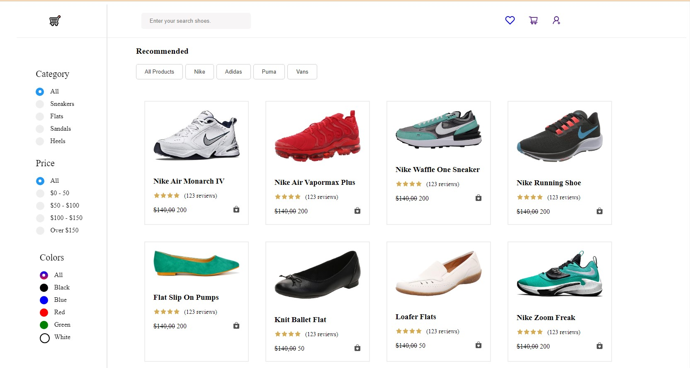

### E-Commerce with Advance Filter Option

- This is a ReactJs E-Commerce website for selling shoes with Adavnce Filter feature
- This whole project is for the Advance Filter option to work with multiple filter to be selected at the same time
- No API are used to call for the product data's but the data are given in pre fixed of 30 or more can be added.
- then React Icons are used to get symbols for the projects
- then for reactjs useStae and various other handler such us HandleClick, handleChange, onClick JavaScript used to have dynamic changes made for filter option.

## Result image:

